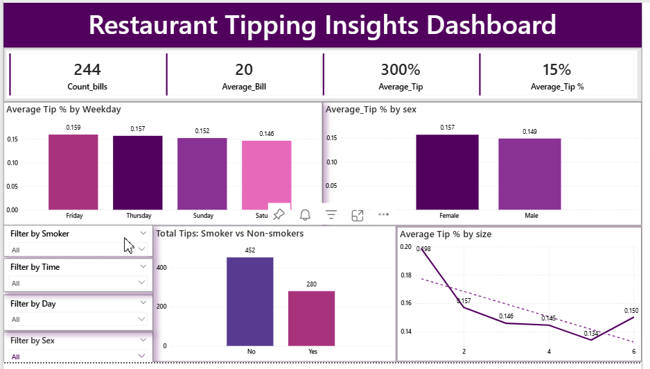

# Restaurant Billing & Tipping Behavior Dashboard

## Project Overview
This project explores tipping behavior in restaurants to understand how customer characteristics and dining context influence tip amounts.

The goal is to help restaurant owners and managers make data-informed decisions about service strategy and customer experience.

---

## Business Question
What factors influence tipping behavior in restaurants?

---

## Dataset
The dataset contains real restaurant transaction records including:
- Total bill amount
- Tip amount
- Gender
- Smoking status
- Day of the week
- Time of day (Lunch/Dinner)
- Party size

---

## What I Analyzed
- Tip percentage by gender
- Lunch vs dinner tipping behavior
- Relationship between total bill and tip
- Tipping patterns by day of the week
- Effect of party size on tipping

---

## Key Insights
- Customers tip an average of 15%, which aligns closely with U.S. restaurant standards.

- Friday receives the highest average tip percentage, suggesting end-of-week dining may create more generous tipping behavior.

- Female customers tip slightly more than male customers, with a higher average tip percentage.
This may relate to differences in order types or spending patterns.

- Non-smokers tend to give significantly higher total tips compared to smokers.
 This may be because:
- Non-smokers dine in larger groups.
- They purchase higher-value meals.
- They stay longer and order more.

- Tip percentage decreases as group size increases.
 This is a classic behavioral trend, larger groups often rely on shared or split contributions, reducing individuals’ tipping proportions.

- Higher bills generally lead to higher absolute tips, but not higher tip percentages.

---

## Dashboard Preview

---

## Tools Used
Power BI | Power query
